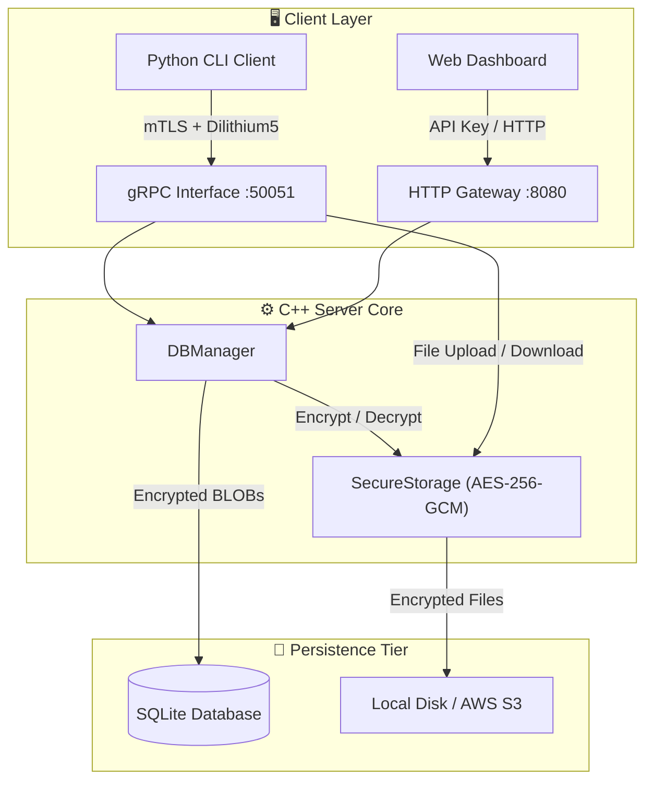

# Universal PQC Backend

**Secure. Scalable. Quantum-Safe.**

[](https://doi.org/10.5281/zenodo.19024628)
[](https://www.researchgate.net/publication/402053990_Quantum_Safe_Backend_Design_and_Implementation_of_a_Post-Quantum_Cryptographic_Secure_Storage_and_Communication_Platform?_tp=eyJjb250ZXh0Ijp7InBhZ2UiOiJzcG90bGlnaHQiLCJwcmV2aW91c1BhZ2UiOm51bGwsInBvc2l0aW9uIjoicGFnZUNvbnRlbnQifX0)

The **Universal PQC Backend** is an industrial-grade secure storage and messaging platform designed for the post-quantum era. It leverages **CRYSTALS-Dilithium5** for quantum-resistant transport security and **AES-256-GCM** for encryption-at-rest, ensuring data remains confidential against both classical and future quantum threats.

---

## 📄 Research & Documentation

This project is backed by a formal technical paper detailing the cryptographic implementation and performance benchmarks.

* **Official DOI:** [10.5281/zenodo.19024628](https://doi.org/10.5281/zenodo.19024628)
* **Full Paper (Zenodo):** [Read the Publication](https://zenodo.org/records/19024628)
* **ResearchGate:** [View Preprint & Stats](https://www.researchgate.net/publication/402053990_Quantum_Safe_Backend_Design_and_Implementation_of_a_Post-Quantum_Cryptographic_Secure_Storage_and_Communication_Platform?_tp=eyJjb250ZXh0Ijp7InBhZ2UiOiJzcG90bGlnaHQiLCJwcmV2aW91c1BhZ2UiOm51bGwsInBvc2l0aW9uIjoicGFnZUNvbnRlbnQifX0)

---

## 🏗️ System Architecture

The platform is engineered as a hybrid C++/Python stack, synthesizing post-quantum transport security with classical symmetric encryption-at-rest.

### Logical Data Flow



### Technical Stack

* **Security Foundation:** OQS-OpenSSL 1.1.1 + liboqs 0.8.0.
* **Transport:** CRYSTALS-Dilithium5 (Signatures) & Kyber768 (KEM).
* **Rest Security:** AES-256-GCM with atomic key rotation.
* **Infrastructure:** Multi-stage Docker (Ubuntu 22.04 LTS base).

---

## 🚀 Core Features

* **Quantum-Safe Transport:** Communication is secured using a custom OpenSSL build with Dilithium5 signatures and Kyber key encapsulation.
* **Encrypted Persistence:** Data is stored in a robust SQLite database, transparently encrypted with AES-256-GCM.
* **Dual-Stack API:** Serves gRPC and HTTP/REST simultaneously.
* **Cloud Scalability:** Built-in support for offloading large encrypted files to AWS S3.
* **Secure File Transfer:** Streaming upload/download capabilities with automatic encryption.

---

## 🛠️ Installation

The entire system is containerized. Building the image compiles the full custom cryptographic toolchain.

### Prerequisites

* Docker & Docker Compose
* Linux Environment (Ubuntu 20.04+ recommended)

### Build & Run

```bash
./setup.sh
```

To run the server manually:

```bash
docker run -d --name pqc-server \
  -p 50051:50051 -p 8080:8080 \
  -v "$(pwd)/certs:/app/certs" \
  -v "$(pwd)/data:/app/data" \
  pqc-server
```

---

## ⚙️ Configuration

Configuration is managed via `config.json`.

```json
{
  "address": "0.0.0.0:50051",
  "storage_path": "data/storage.bin",
  "http_api_key": "your-secure-api-key",
  "use_s3": false,
  "s3_bucket": "my-secure-bucket"
}
```

---

## 📜 License & Acknowledgments

Copyright (c) 2026 Sujith B. All rights reserved.
Licensed under the Apache License, Version 2.0.

Special thanks to:

* **[Open Quantum Safe](https://openquantumsafe.org/):** For `liboqs` and the OQS-OpenSSL fork.
* **[@Mester-Oxdan](https://github.com/Mester-Oxdan):** For system and compilation support.

**Disclaimer:** This software is intended for industrial research and forward-looking security implementation. While it utilizes NIST-selected algorithms, it has not undergone FIPS 140-3 certification.
